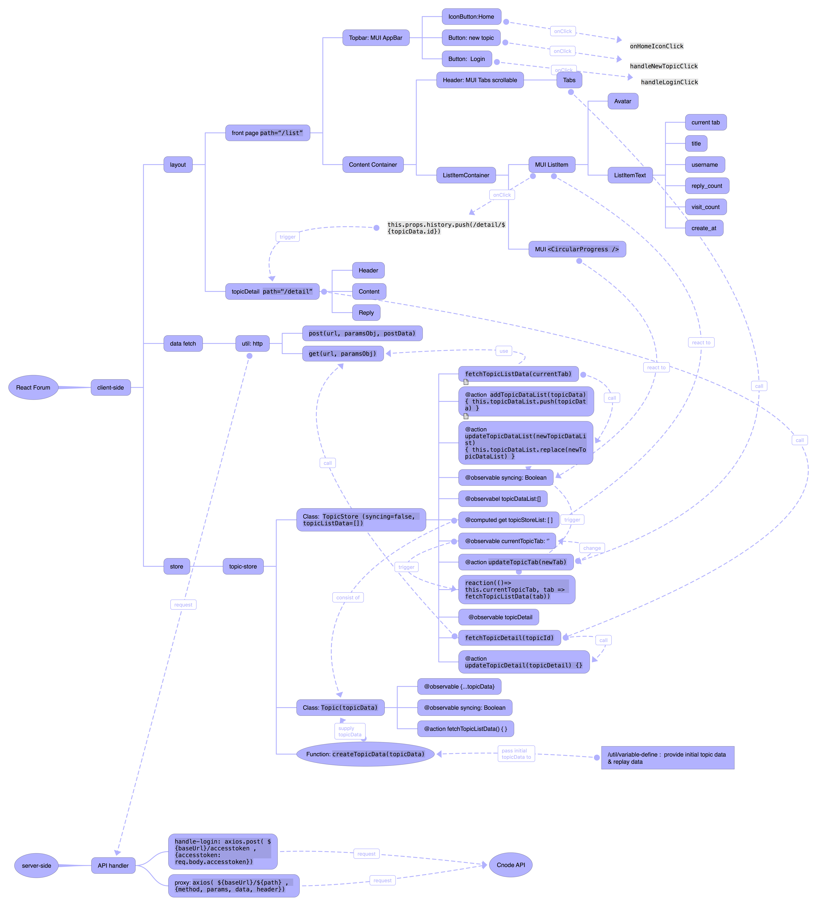

# 项目介绍

## 工程架构
参考: [git repo:An-Initialized-SSR-React-Project](https://github.com/dudueasy/An-Initialized-SSR-React-Project)
服务端渲染 for React Router 4 
服务端渲染 for Mobx
服务端渲染 for Material-UI

## 文件结构
### 客户端 bundle 入口
client/app.js
### Express 服务器入口
server/index.js

## 功能实现和依赖
### 前端路由
React-router
### store solution
Mobx
### session
express-session

## 使用前须知
需要通过 .env 文件中的字段来配置整个项目, 请参考 .env.defult 和以下配置
~~~ 
NODE_ENV=production
HOST_NAME=http://127.0.0.1
NODE_SERVER_PORT=8011
~~~

## 数据服务
express 服务器作为静态文件服务器和 api 反向代理服务器. 

CNode API 作为数据源.

## build & start
# start client rendering
~~~
npm start
~~~

# start server rendering (buggy)
~~~
npm run dev:server
~~~

# build
~~~
npm run build
~~~

# Overall Structure

